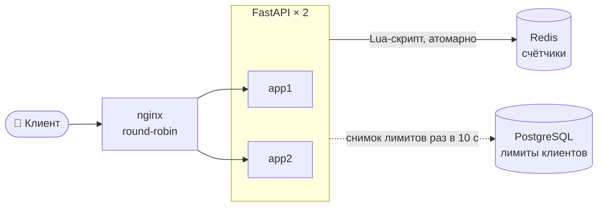
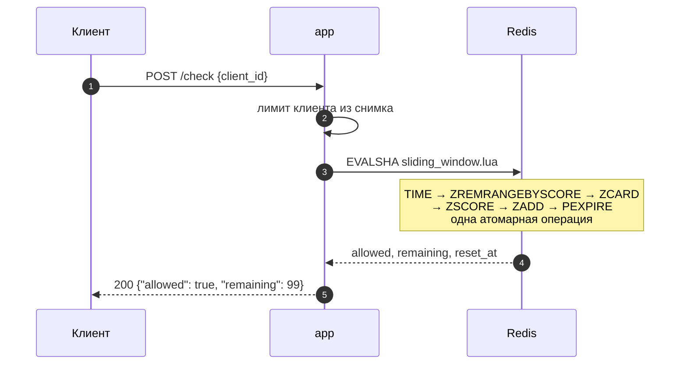
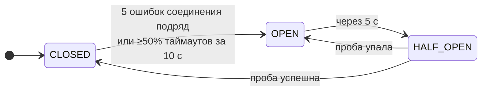
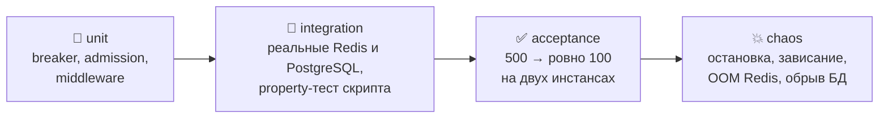
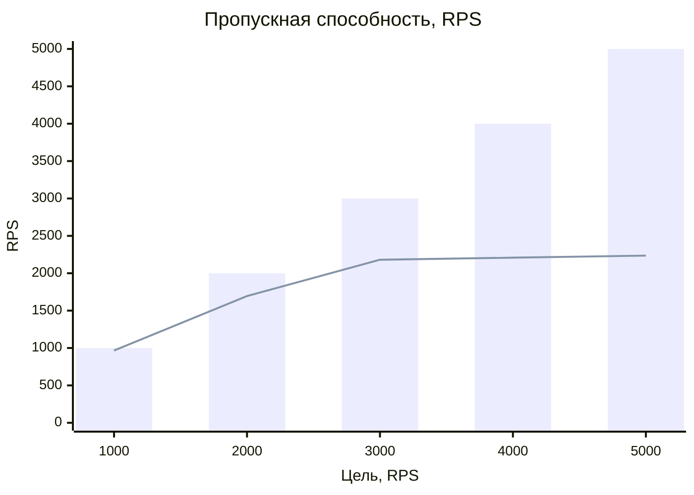
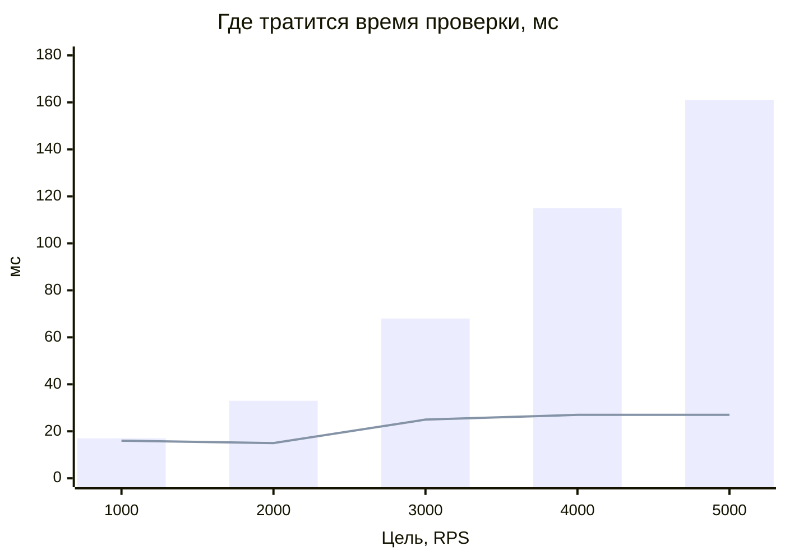

<div align="center">

# 🚦 Rate Limiter

**100 запросов за любые 60 секунд на `client_id` — один счётчик на все инстансы**

[](https://github.com/GoldExtremal/rate-limiter/actions/workflows/ci.yml)


[🏗️ Архитектура](#️-архитектура) •
[🚀 Запуск](#-запуск) •
[🔌 API](#-api) •
[⚙️ Как работает](#️-как-это-работает) •
[🧪 Тесты](#-тесты-и-команды) •
[📈 Нагрузка](#-нагрузка) •
[🧠 Решения](#-решения) •
[❓ Вопросы](#-ответы-на-вопросы) •
[🗺️ Не сделано](#️-что-не-сделано)

</div>

## 🏗️ Архитектура



| | |
| --- | --- |
| 🎯 Точность | sliding window: не больше 100 за **любые** 60 секунд |
| ⚛️ Атомарность | проверка и списание — один Lua-скрипт в Redis |
| 🧩 Состояние | только в Redis, в памяти инстансов счётчиков нет |
| 🛡️ Отказы | Redis упал — сервис жив и восстанавливается без рестарта |

## 🚀 Запуск

> Нужен только Docker (Engine 24+, Compose v2).

```bash
docker compose up --build
```

```bash
curl -X POST localhost:8080/check -H 'Content-Type: application/json' -d '{"client_id": "user_123"}'
# {"allowed": true, "remaining": 99, "reset_at": 1720000060, "degraded": null}

curl -i localhost:8080/demo -H 'X-Client-Id: user_123'
# 200 + X-RateLimit-Limit / Remaining / Reset, после лимита — 429 + Retry-After
```

| Адрес | Что это |
| --- | --- |
| `localhost:8080` | 🌐 nginx — точка входа |
| `127.0.0.1:8001`, `:8002` | 🔧 app1 и app2 напрямую, там же `/metrics` |
| `127.0.0.1:9090`, `:3000` | 📊 Prometheus и Grafana (`make monitoring`) |

Порты и настройки — в [`.env.example`](.env.example), `.env` не обязателен. Миграции
применяются сами. Логи — одна строка JSON на запись (`LOG_FORMAT=text` для
локальной отладки).

## 🔌 API

| Метод | Ответ |
| --- | --- |
| `POST /check` | `{"client_id", "request_id"?}` → **всегда 200**, решение в `allowed` |
| `GET /demo` | по `X-Client-Id`: 200 или **429** + `X-RateLimit-*` и `Retry-After` |
| `GET /health` | всегда 200, состояние breaker и лимитов |
| `GET /metrics` | Prometheus, только на инстансах |

- `client_id` — любая строка 1–256 символов.
- `request_id` / `X-Request-Id` — повтор с тем же id не списывает второй слот.
- `degraded` — почему решение принято без Redis: `redis_unavailable`,
  `redis_timeout`, `overloaded`.

## ⚙️ Как это работает

### Один запрос



- ⏱️ Время берётся из Redis — часы инстансов не важны.
- 🧹 TTL по последней записи — ключ неактивного клиента исчезает сам.
- 🚫 `noeviction` — при нехватке памяти Redis отклоняет запись, а не стирает
  чужие счётчики.

### Когда Redis болеет



| Ситуация | `/check` | `/demo` |
| --- | --- | --- |
| ✅ Лимит есть | `allowed: true` | 200 |
| ⛔ Лимит превышен | `allowed: false` | 429 |
| 🔓 Redis недоступен, fail-open *(по умолчанию)* | `allowed: true` + `degraded` | 200 |
| 🔒 Redis недоступен, fail-closed | `allowed: false` + `degraded` | 503 |
| 🐢 Одиночный таймаут или перегрузка | `allowed: false` + `degraded` | 503 |

> [!IMPORTANT]
> Перегрузка и одиночный таймаут **никогда** не включают fail-open: иначе под
> атакой лимит выключался бы ровно тогда, когда он нужнее всего. Технический сбой
> никогда не даёт 429.

## 🧪 Тесты и команды

| Команда | Что делает |
| --- | --- |
| `make check` | ✔️ ruff, mypy `--strict`, promtool, все тесты с покрытием |
| `make test-acceptance-repeat` | 🔁 приёмка 500 → 100 десять раз подряд |
| `make test-chaos` | 💥 отказы Redis и PostgreSQL |
| `make load` / `make load-saturation` | 📈 нагрузка: устойчивая / ступенями до насыщения |
| `make monitoring` | 📊 Prometheus + Grafana с дашбордом и алертами |
| `make audit` | 🔐 уязвимости зависимостей и образа |
| `make down` | 🧽 остановить и удалить всё |



## 📈 Нагрузка

<details>
<summary>🖥️ Условия замера</summary>

| | |
| --- | --- |
| Машина | AMD Ryzen 5 5500U (6 ядер / 12 потоков), 22 ГБ RAM, Ubuntu 24.04, Docker 29.1 |
| Ресурсы | app1, app2, nginx, Redis — по 1 CPU; PostgreSQL — 0,5; Locust — 4 (`compose.load.yml`) |
| Сервис | 2 инстанса × 1 воркер uvicorn, без `--reload` |
| Генератор | Locust, 4 процесса, через nginx |
| Данные | 10 000 клиентов + 1 «горячий», 3 строки в `client_limits` |
| Прогон | прогрев 30 с, замер 120 с, перцентили |

</details>

**Устойчивая нагрузка** (150 пользователей × 10 RPS):

| RPS | Ошибки | p50 | p95 | p99 | degraded |
| :---: | :---: | :---: | :---: | :---: | :---: |
| **1462** | 0 | 10 мс | 110 мс | 180 мс | 0 |

**Поиск насыщения** (`make load-saturation`):



*Столбцы — целевой RPS, линия — фактический.*



*Столбцы — вся проверка в приложении, линия — вызов Redis.*

> [!NOTE]
> **Узкое место — CPU однопоточных инстансов, а не Redis.** Redis выполняет скрипт
> за **69 мкс** и загружен на ~25 %; за точкой насыщения (~2200 RPS) растёт только
> очередь перед Redis. Масштабируется добавлением инстансов. Даже за насыщением —
> **0 деградированных решений**.

## 🧠 Решения

| ✅ Выбрали | ❌ Вместо | 💡 Почему |
| --- | --- | --- |
| Sliding window (лог в ZSET) | fixed window, sliding counter | fixed пропускает до 200 за 60 с, counter приближённый |
| Один Lua-скрипт | `MULTI`/`WATCH`, раздельные команды | нет гонки между проверкой и списанием |
| Fail-open по умолчанию | fail-closed | отказ лимитера не должен ронять весь API |
| Таймаут при закрытом breaker — отказ | таймаут — fail-open | иначе под нагрузкой лимит выключается при живом Redis |
| `noeviction` | вытеснение ключей | вытеснение молча обнуляет счётчик |
| Лимиты в PostgreSQL | лимиты в env | это данные, а не конфигурация деплоя |
| nginx не повторяет `/check`, `/demo` | повтор на соседний инстанс | один запрос списался бы дважды |
| Свой breaker и admission | готовые библиотеки | мало кода, каждая строка объяснима |

<details>
<summary>📌 Интерпретации задания</summary>

- «`/check` всегда 200» — для валидного запроса; 422 на невалидный и 500 на баг
  остаются.
- PostgreSQL из общих требований хранит конфигурацию лимитов.
- `reset_at` — момент, когда освободится ближайший слот.
- `/check` — внутренний API: `client_id` приходит в запросе, аутентификация вне
  рамок задания.

</details>

## ❓ Ответы на вопросы

<details open>
<summary><b>1. Что делает проверку атомарной?</b></summary>

Вся проверка — один Lua-скрипт: `TIME → ZREMRANGEBYSCORE → ZCARD → ZSCORE → ZADD →
PEXPIRE`. Redis выполняет скрипт целиком и не переключается на команды других
клиентов — между подсчётом и списанием никто не вклинится. Раздельных команд из
Python нет.

</details>

<details open>
<summary><b>2. Худший случай fixed window?</b></summary>

До **200** запросов за 60 секунд: 100 в конце одного окна и 100 в начале
следующего. Здесь sliding window — не больше 100 за любые 60 секунд.

</details>

<details open>
<summary><b>3. Redis недоступен 30 секунд — что видит клиент?</b></summary>

- 🔌 **Остановлен:** после 5 ошибок соединения breaker открывается, ответы
  мгновенные. Fail-open: `allowed: true, degraded: "redis_unavailable"`; fail-closed:
  `allowed: false` и 503 на `/demo`. Ни одного 429.
- 🐢 **Завис:** запросы ждут не дольше 500 мс и отклоняются (`redis_timeout`), пока
  breaker не откроется по доле таймаутов.
- 🔄 **Вернулся:** проба раз в 5 с закрывает breaker, всё восстанавливается без
  рестарта, счётчики начинаются заново.
- 💡 **Почему fail-open:** лимитер защищает API, а не является бизнес-функцией — его
  отказ не должен становиться отказом сервиса. Цена — на время сбоя строгой
  гарантии нет; breaker и admission control её ограничивают.

</details>

## 🗺️ Что не сделано

| | Почему не сделано |
| --- | --- |
| 🔐 Аутентификация `/check` | задание её не оценивает, а обязательная авторизация сломала бы контракт `{"client_id"}` |
| 🏛️ HA Redis (Sentinel / Cluster) | отдельная инфраструктура; репликация асинхронная, и при failover теряются последние миллисекунды счётчиков. Скрипт к Cluster готов |
| ⚡ Мгновенные лимиты через `LISTEN/NOTIFY` | лимиты меняют редко — 10 секунд согласования достаточно |
| 🔭 Трассировка (OpenTelemetry) | на запрос один вызов Redis — метрик и JSON-логов достаточно |
